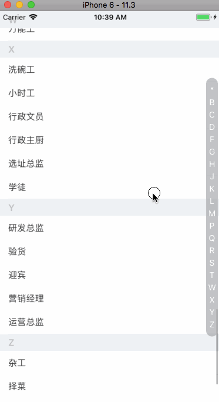

# react-native-index-list

[](https://www.npmjs.org/package/react-native-index-list)
[](https://www.npmjs.com/package/react-native-index-list)

A Listview with a sidebar to directly jump to sections.

## Example



## Installation

```bash
$ npm install --save react-native-index-list
```

## Usage

[See the example](./examples/Basic/App.js)
